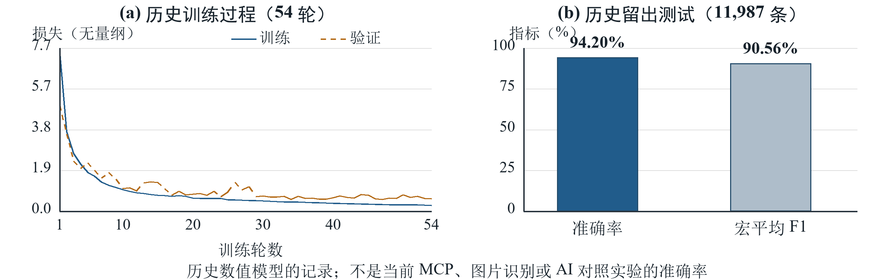

# BandStructure MCP · 第二版（v2.0.0）

[English](README.en.md) · [部署与客户端](docs/DEPLOYMENT.md) · [训练方法](docs/TRAINING.md) · [验证范围](docs/V2_VERIFICATION.md) · [MIT](LICENSE)

让 AI 阅读能带论文，让可检查的工具处理数值、来源和导出。推荐通过 Docker 在 **Windows / Linux（x86-64）** 运行，提供 stdio 和带认证的 Streamable HTTP 接口。当前服务无需显卡、CUDA、Materials Project 密钥或历史模型权重。

> **科研辅助软件，不是 DFT 计算引擎或已通过独立科学验收的预测模型。** 未知置信度保持 null；不能仅凭能带图唯一确认元素、晶体或合成路线，不能把 AI 标注称为真人审核。

## 1. 项目介绍与应用领域

本项目向支持模型上下文协议（MCP）的 AI 工具提供17个工具、5项资源和2个提示模板：

- 组织论文阅读步骤，区分电子能带、声子、态密度、缺陷能级与输运图。
- 检查 AI 提交的单位、坐标、能量参考、路径断点、原文件摘要和证据字段。
- 提取图中可见内容，分析用户提供的数值能带；分别处理路径采样和均匀网格。
- 导入受支持的 VASP XML、POSCAR、图片和PDF，输出可追溯的JSON、CSV、SVG及分页结果。
- 协助整理组成、晶体结构、材料性质和合成文献，不认证引文真实性或实验可行性。

适用于半导体、热电、光伏、电池、超导材料的文献入门、教学演示和数据整理。工程设计、实验合成及论文准确率结论仍需独立证据。

## 2. 工作原理与模型调用

[可编辑SVG](docs/figures/mcp_architecture.svg)

1. 操作者选择文件，本地适配器生成附件编号和SHA-256摘要，模型不需要编造文件字节。
2. 宿主AI利用自身视觉/OCR和语言能力读原图、查文献、选择区域并提出结构化观察。
3. 客户端按 initialize → tools/list → tools/call 调用MCP，可经Docker内stdio或 /mcp HTTP端点。
4. MCP检查来源和数值合约，计算已给出的样本，返回结果或缺失证据。
5. 宿主解释结果；独立专家负责最终科学验收。未知分支、缺失样本和路径断点不会被伪造补全。

**模型由宿主调用，不由MCP再调用一次。当前MCP不加载历史神经网络、ANN索引或DFT求解器。** 本地OCR/PDF解析只是后备。协议背景见[MCP官方架构](https://modelcontextprotocol.io/specification/2025-11-25/architecture)。

| 比较项 | 不接入本项目MCP | 接入本项目MCP |
| --- | --- | --- |
| 看图与解释 | 宿主原有能力 | 仍由宿主提供 |
| 数值计算 | 取决于宿主代码和工具 | 统一、可测试的路径/网格合约 |
| 来源和坐标 | 宿主自行组织 | 摘要绑定、区域和轴检查 |
| 缺失项与导出 | 取决于工作流 | 明确拒绝/补证、保留断点和追溯 |
| 准确率、速度增益 | 未完成匹配对照 | **不报告未经实测的提升比例** |

AI-only也能编程或使用其他工具；这是功能比较，不是优越性实验。

## 3. 历史训练方法与效果

当前MCP **无需训练**。历史离线预研以AFLOW数值能带为输入，先遮蔽部分点进行恢复训练，再微调分类和带边任务；不是用1000张论文图片训练当前服务。

- 平台记录：2×NVIDIA Tesla V100-SXM2，每卡16GB；不代表每次实验均双卡并行。
- 归档环境：Python 3.11、TensorFlow 2.21、CUDA 12.5.82、cuDNN 9.3.0.75，独立于CPU版MCP容器。
- 数据：60,000条AFLOW记录，59,899条构成128点×6通道输入，101条因缺少带边跳过。
- 空间群分组：47,912条训练、11,987条外部测试，不共享空间群；内部验证用于选模。
- 图中采用摘要核验一致的恢复归档：seed 42、54轮、最优第34轮。归档混淆矩阵复算准确率94.20%、宏平均F1 90.56%。

**这些数字不是MCP、图片识别或AI对照实验准确率。** 另一份51轮日志未混入；带隙任务存在直接解析基线，小回归误差不等于独立物理预测能力。

[训练程序、方法、数据来源与复现限制](docs/TRAINING.md) · [图表数值与摘要](docs/figures/paper_metrics.json)。

## 4. 实战效果

0.7.1阶段记录了六篇论文69页、正文链路76次真实工具调用，恢复7个电子面板可见内容，并从作者数值数据绘出43条与65条已提供能带。第二版部署测试单独见[验证记录](docs/V2_VERIFICATION.md)，不把旧结果当作新测试。

| 论文/体系 | 处理范围 |
| --- | --- |
| [PRX Energy：BaB₂、ZrRuSb、TaRu₃C](https://doi.org/10.1103/sb28-fjc9) | 电子与声子分开；作者数据扩展不冒充隐藏能带推断 |
| [ACS Energy Letters：NMC正极](https://doi.org/10.1021/acsenergylett.1c02028) | 所测声子图不用于电子带隙 |
| [JMCA：Na₃OCl](https://doi.org/10.1039/D1TA07588H) | 离子输运不是E(k)，还需采用[勘误](https://doi.org/10.1039/D2TA90105F) |
| [ACS AMI：ZnGa₂O₄](https://doi.org/10.1021/acsami.5c19146) | 可见面板恢复；原文静态间接隙5.08eV，不恢复图外导带 |
| [EES：kesterite光伏](https://doi.org/10.1039/D0EE00291G) | 缺陷跃迁能级与构型坐标不伪装成电子能带 |
| [JMCA：Bi₂MO₄Cl](https://doi.org/10.1039/D5TA05523G) | 路径与作者网格分开，合成追溯原始实验来源 |

这些案例已被查看，**不是盲测集**。论文、下载图像、权重和本地1000条数据不随仓库发布，版权另属权利人。

## 5. 部署、依赖与客户端

先安装Git和运行Linux containers的Docker Engine/Desktop、Compose v2；Windows使用WSL2后端。建议至少4GB可用内存、3GB磁盘空间，首次构建需联网。Docker Desktop有独立许可，也可使用Linux/WSL中的开源Docker Engine。

    git clone https://github.com/peiyang-z6/BandStructure_AI_Project.git
    cd BandStructure_AI_Project
    docker compose run --build --rm setup
    docker compose up -d --wait --wait-timeout 120
    docker compose cp bandstructure:/data/client-configs ./.bandstructure-clients

Windows可运行 ./scripts/start.ps1，Linux可运行 sh scripts/start.sh。生成的配置含访问凭据，**禁止提交或分享**。默认端点 http://127.0.0.1:8765/mcp 仅映射回环地址，必须认证。

| 客户端 | 接入方式 |
| --- | --- |
| Hermes | 合并hermes.config.json中的mcp_servers对象，HTTP＋认证头 |
| Claude Code | 合并claude-code.mcp.json，HTTP |
| Claude Desktop | 合并claude-desktop.json，docker exec -i stdio |
| VS Code | 合并vscode.mcp.json到用户MCP配置或.vscode/mcp.json |
| ChatGPT | 有权限的Secure MCP Tunnel，或自管HTTPS＋OAuth；**localhost不是云端地址，静态Bearer不是ChatGPT UI OAuth** |

附件由操作者导入，不给模型任意文件路径权限：

    docker compose exec bandstructure mkdir -p /data/inbox
    docker compose cp ./paper.pdf bandstructure:/data/inbox/paper.pdf
    docker compose exec bandstructure bandstructure-attach /data/inbox/paper.pdf

将输出的att_...编号交给AI；大PDF可用--page 5导入指定页。每个实例是**单一所有者**的数据空间，同实例客户端共享附件；不同用户使用不同实例、数据卷和凭据。

[完整部署、OAuth、备份、故障排查及官方资料](docs/DEPLOYMENT.md)。本仓库不会自动创建域名、OAuth账号、云服务或收费资源。

原创代码为[MIT](LICENSE)，依赖保留自己的许可；含PDF栈的Docker镜像还须遵守[第三方说明](THIRD_PARTY_NOTICES.md)，不能把所有依赖称为MIT。欢迎任何人Fork、Issue和PR，主分支不开放匿名直接写入。[贡献指南](CONTRIBUTING.md)。

## 6. 开发者说明

我是机械专业的个人开发者，并非计算材料科学科班出身。本项目在AI agent辅助下，参考开源协议、库和公开研究逐步完成，希望成为能带文献阅读和DFT入门的辅助工具。实现仍可能有错，恳请感兴趣的研究者和开发者批评指正。

项目公开原创源码，核心运行依赖开源组件；但开发过程使用过AI工具和文档软件，宿主也可能是闭源服务，因此不作“全过程未使用任何闭源软件”的不实承诺。AI辅助开发不替代专业验证，我愿意根据可复现证据持续改进。
