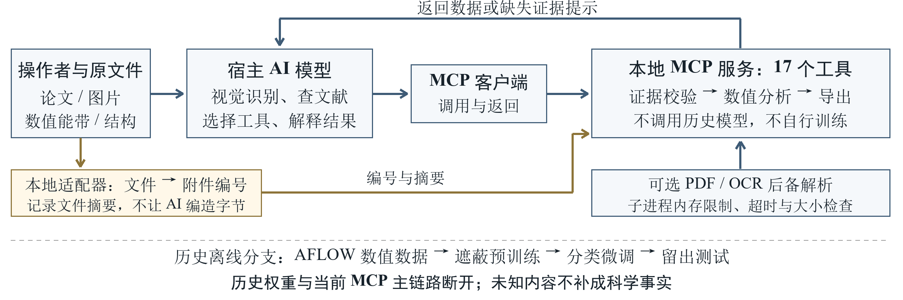

# Architecture and manuscript figures

- Editable vector: [mcp_architecture.svg](mcp_architecture.svg).
- Historical quantitative figure: [historical_training_evaluation.png](historical_training_evaluation.png), [SVG](historical_training_evaluation.svg).
- Reviewed aggregate values and source hashes: [paper_metrics.json](paper_metrics.json).

The host AI owns vision, literature reading and interpretation. The MCP exposes
bounded evidence/geometry/numerical/export tools and optional parser/OCR fallbacks.
The operator adapter registers bytes and attachment IDs. Historical neural-model
weights are not used by the current MCP. An unverified result is not human approval.

The historical figure uses one consistent recovered archive (seed 42, 54 epochs,
best epoch 34), not the mixed 51-epoch file in the active historical directory.
The accepted weight SHA matches its selection manifest. Test accuracy (94.20%) and
macro F1 (90.56%) were recomputed from the stored three-class confusion matrix,
with 11,987 samples. These are archived numerical-model results, not a new training
run, a paper-image benchmark, a blind evaluation or an AI-only versus AI+MCP gain.

Recreate SVG/PNG with `python scripts/render_paper_figures.py` in an authoring
environment with Pillow and the indicated CJK/Latin fonts. Font files, raw papers,
private logs, model weights and the manuscript template are not bundled here.
Windows font paths are the defaults; other platforms can supply local font files
with `--cjk-font`, `--cjk-bold-font`, `--latin-font` and `--latin-bold-font`.
The figures have no unit-dependent effective-mass or hidden-band reconstruction claim.
